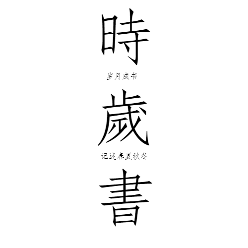

# 资料

- 关于农历（干支太岁）。

# 历法进度
- [x] 农历
- [ ] 佛历
  - [ ] 缅历
  - [ ] 泰历
  - [ ] 傣历
- [ ] 民族历
  - [ ] 藏历
  - [ ] 彝历
  - [ ] 水历
- [ ] 儒略历
- [ ] 伊斯兰历
- [ ] 诸纪年
  - [x] 民国（主体）纪年
  - [ ] 黄帝纪年
  - [ ] 夫子纪年
- [ ] 帝王纪年
  - [ ] 中国年号
  - [ ] 日韩越年号
- [ ] 其它历法